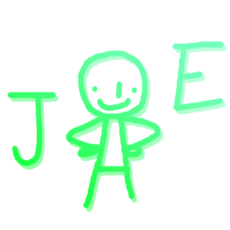

>[!CAUTION] The only official place you can get Joe from is from this GitHub repository. Anywhere else isn't my responsiblity as it's not owned by me. Online-Safety 101 etc.

# 

 Joe is a Roblox URL handler for Sober that makes things work as it should, no matter what app tries to launch Sober, because Joe is just a standup guy. 
 
 Whether it's running Roblox from Firefox, or with some extremely peculiar Linux black-magic, Joe's got you covered. 

 # Installing

 Just run "install.sh" in your terminal of choice WITHOUT sudo.

### READ SCRIPTS BEFORE RUNNING THEM!!!

----
Not affiliated with VinegarHQ or the Sober project.
